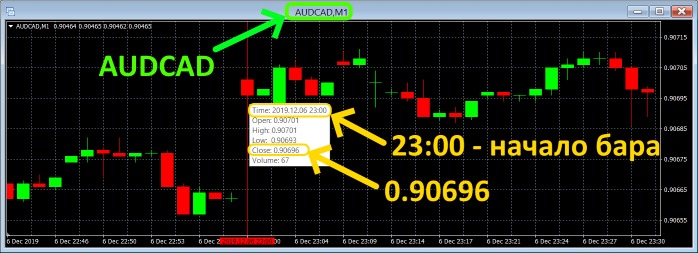
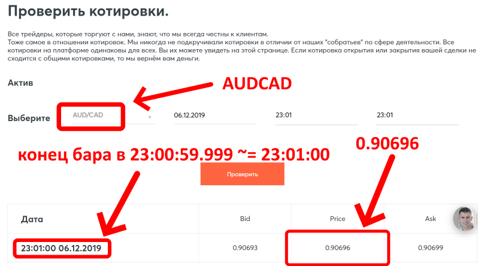

# intrade-bar-historical-data

Исторические данные котировок брокера [intrade.bar](https://intrade.bar/67204)

## Описание

Брокер [intrade.bar](https://intrade.bar/67204) использует котировки от [FXCM](https://www.fxcm.com/). При этом цена вычисляется как *(bid + ask) / 2*. Данный репозиторий содержит исторические данные цен и объемов баров всех валютных пар, представленных на торговой площадке [intrade.bar](https://intrade.bar/67204). Все цены бара (open, high, low, close) рассчитаны по цене *(bid + ask) / 2*.

## Технические подробности

* Брокер [intrade.bar](https://intrade.bar/67204) использует округление дробной части котировок до ближайшего целого, что учтено в исторических данных. 
Например, пятизначная цена *bid = 1.40786*, цена *ask = 1.40789*, тогда цена *(bid + ask) / 2 = 1.407875 = 1.40788*.

* Брокер фиксирует цену в начале каждой секунды. Поэтому цена закрытия бара равна цене брокера в самом начале следующей минуты. 
Например, бар открылся в *23:00:00*, цена закрытия бара будет соответствовать цене брокера в *23:01:00*. Если хотите торговать по цене закрытия, просто открывайте сделку на следующей минуте в нулевую секунду.

* Данный репозиторий хранит котировки в формате [qhs5](https://github.com/NewYaroslav/xquotes_history). Это позволяет заметно сжать данные, но может быть неудобно для использования. Для преобразования *qhs5* в *csv* файлы репозиторий содержит специальную утилиту *bin/xqhtools.exe*. Инструкция по применению: *bin/README.md*. Для преобразования в *csv-файлы* с часовым поясом *UTC+3* (Московское время) достаточно запустить *bat-файл* *bin/build-mt4-msk-csv.bat*, для *UTC* времени нужно запустить *bat-файл* *bin/build-mt4-utc-csv.bat*. Недостающие *.dll* библиотеки находятся в архиве *bin/dll.7z*. После запуска *bat-файла* и завершения работы утилиты *xqhtools* все *csv-файлы* будут расположены в папке *csv* данного репозитория.

## Загрузка исторических данных

Для загрузки исторических данных необходимо запустить программу *bin/intrade-bar-downloader.exe* через *bat-файл* *bin/run-intrade-bar-downloader.bat*.
По умолчанию программа настроена на загрузку всех данных, кроме текущего дня. Ранее записанные данные не будут загружены, однако может быть обновлен последний день.

Программа *intrade-bar-downloader* скачивает котировки от [FXCM](https://www.fxcm.com/) и записывает их в формате *qhs5*. Все *qhs5-файлы* в данном репозитории расположены в папке *storage*. Рекомендую использовать данный репозиторий с загруженными историческими данными, так как программа *intrade-bar-downloader* всегда загружает максимально возможную историю, и **загрузка с полного нуля займет много времени (порядка 40-80 минут на одну валютную пару, всего валютных пар 26)**.

Более подробно про программу *intrade-bar-downloader* можно найти информацию в инструкции *bin/README.md*.

**Во время выходных программа не работает!**

## Сравнение с котировками брокера

Пример сравнения цены закрытия бара исторических данных по AUDCAD с котировой брокера:

## Диапазон дат исторических данных

- EURUSD 03.12.2001 - 08.12.2019
- USDJPY 03.12.2001 - 08.12.2019
- GBPUSD 03.12.2001 - 08.12.2019
- USDCHF 03.12.2001 - 08.12.2019
- USDCAD 04.12.2001 - 08.12.2019
- EURJPY 29.11.2001 - 08.12.2019
- AUDUSD 14.12.2002 - 08.12.2019
- NZDUSD 04.12.2001 - 08.12.2019
- EURGBP 01.02.2002 - 08.12.2019
- EURCHF 06.12.2001 - 08.12.2019
- AUDJPY 28.11.2001 - 08.12.2019
- GBPJPY 28.11.2001 - 08.12.2019
- CHFJPY 03.12.2001 - 08.12.2019
- EURCAD 30.11.2001 - 08.12.2019
- AUDCAD 30.07.2003 - 08.12.2019
- CADJPY 29.11.2001 - 08.12.2019
- NZDJPY 29.11.2001 - 08.12.2019
- AUDNZD 29.11.2001 - 08.12.2019
- GBPAUD 29.11.2001 - 08.12.2019
- EURAUD 29.11.2001 - 08.12.2019
- GBPCHF 30.11.2001 - 08.12.2019
- EURNZD 31.03.2008 - 08.12.2019
- AUDCHF 29.11.2001 - 08.12.2019
- GBPNZD 30.11.2001 - 08.12.2019
- GBPCAD 29.11.2001 - 08.12.2019
- XAUUSD 28.09.2009 - 08.12.2019
